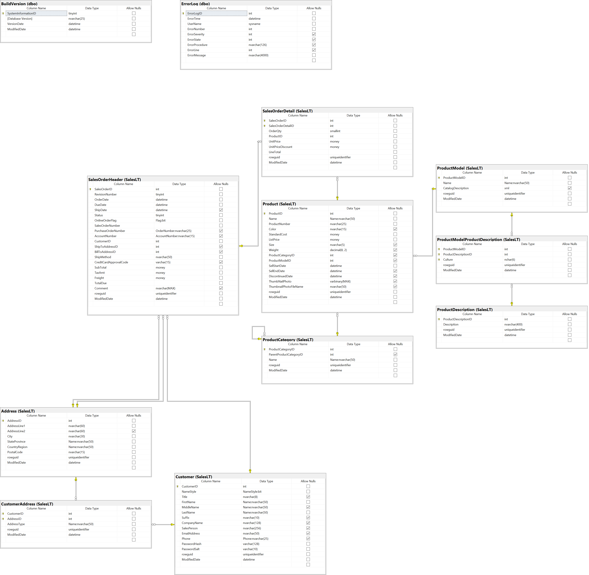

[](https://classroom.github.com/a/A8-IUsbb)
# Task 03: Entity Framework


***

## Student info

> Write your name, your estimation of how many points you will get, and an estimate of how long it took to make the answer

- Student name: 
- Estimated points: 
- Estimated time (hours): 

***

## Purpose of this task

The purposes of this task are:

- to learn Entity Framework
- to learn to reverse engineer an existing database
- to learn to use Entity Framework model classes and the DbContext class

## Material for the task

> **Following material will help with the task.**

It is recommended that you will check the material before start coding.

1. [Entity Framework Core](https://learn.microsoft.com/en-us/ef/core/)
2. [Reverse Engineering](https://learn.microsoft.com/en-us/ef/core/managing-schemas/scaffolding)
3. [Queries in LINQ to Entities](https://learn.microsoft.com/en-us/dotnet/framework/data/adonet/ef/language-reference/queries-in-linq-to-entities)
4. [Client vs. Server Evaluation](https://learn.microsoft.com/en-us/ef/core/querying/client-eval)
5. [Eager Loading of Related Data](https://learn.microsoft.com/en-us/ef/core/querying/related-data/eager)

> **Note!** Read the Prerequisites part of the Reverse Engineering document and install the necessary tools!

> **Note!** Use some database tool to read data from the database so you know how to make the queries. For VS Code check the document [SQL Server extension for Visual Studio Code](https://learn.microsoft.com/en-us/sql/tools/visual-studio-code/sql-server-develop-use-vscode#install-the-mssql-extension).

## The Task

Use Entity Framework and related tools to reverse engineer a database in the cloud. Reverse engineering produces model classes and DbContext. Use the model classes and the context to read data from the database.

> The database is hosted in Azure SQL server (Microsoft SQL Server). The connection string is given in Program.cs file. The database has very limited resources so do avoid expensive queries.

### Evaluation points

1. Reverse engineer database from cloud. The models must be in folder `Data`. Classes must in namespace `EFApp.Data`. Make sure that the generated DbContext class has two constructors. One parameterless and one that that takes `DbContextOptions<T>` as a parameter. Make sure that the generated classes are properly named (i.e. let the scaffolding do the naming). Also make sure that the generated classes does not contain any sensitive information (e.g. connection strings etc.)
2. Add a method named `ProductCategoryItemsListPriceAverageAsync` to DbContext class to count the average of list prices on all products in selected category. The method takes the product category id as input parameter. The method is asynchronous.
3. Add a method named `CustomerAddressesAsync` to DbContext class to return the address entities of a customer. The method takes company name as parameter (field CompanyName). The parameter casing is not relevant and the method must work with any casing (i.e. parameter values: `MyCompany` and `mycompany` must yield the same results). The method is asynchronous.
4. Add a method named `ProductCategoryListAsync` to DbContext class to return a list of strings (`List<string>`) that contains product categories with their sub-categories like:

    ```text
    **1: Bikes**
    1.5: Mountain Bikes
    1.6: Road Bikes
    1.7: Touring Bikes
    **2: Components**
    2.8: Handlebars
    2.9: Bottom Brackets
    2.10: Brakes
        ...
    ```

    The main categories are surrounded with ** ** characters and the sub-categories are listed right after the main category ordered ascending by category id. The main category id is appended to sub-category id (i.e. `mainId.subId:`). The method is asynchronous.

5. Add a method named `GetCustomerInfoAsync` to DbContext class to return a nullable `CustomerInfo` object with all available properties populated (CustomerInfo class is in EFApp/Models folder). The method takes the customer's id and an address type as parameters. If customer is not found by the id then `null` is returned. If the address type is not found then the address properties are not populated. The method must not fail in any case. The method is asynchronous.

> **Note!** Read the task description and the evaluation points to get the task's specification (what is required to make the app complete).

## Task evaluation

Evaluation points for the task are described above. An evaluation point either works or does not work there is no "it kind of works" step in between. Be sure to test your work. All working evaluation points are added to the task total and will count toward the course total. The task is worth five (5) points. Each evaluation point is checked individually and each will provide one (1) point so there are five checkpoints. Checkpoints are designed so that they may require additional code, that is not checked or tested, to function correctly.

## DevOps

There is a DevOps pipeline added to this task. The pipeline will build the solution and run automated tests on it. The pipeline triggers when a commit is pushed to GitHub on the main branch. So remember to `git commit` and `git push` when you are ready with the task. The automation uses GitHub Actions and some task runners. The automation is in the folder named .github.

> **DO NOT modify the contents of .github or tests folders.**

## Database schema


